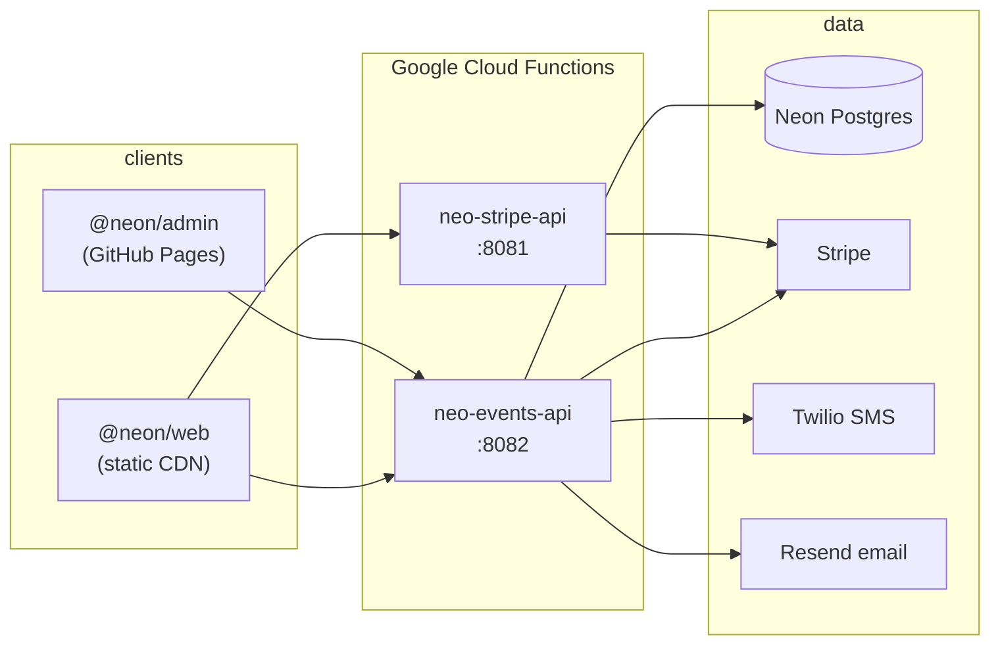

# NEON — neo-neonclub

Monorepo for **[neoncollective.ch](https://neoncollective.ch)**: a fully static public site, event registration and checkout, an internal admin portal, and Google Cloud Functions that power payments, persistence, and staff workflows.

Built as a **pnpm** workspace orchestrated by **Turborepo**, with strict TypeScript end to end.

---

## What lives here

| Surface | Package | Role |
|--------|---------|------|
| **Public site** | `@neon/web` | Next.js 16 static export (`output: "export"`). Block-based CMS content, i18n (de / en / it), event catalog, Stripe Payment Element checkout, participant sign-in (SMS OTP). |
| **Admin portal** | `@neon/admin` | Vite SPA on GitHub Pages. Google SSO (`@neonclub.ch` only). Events, orders, invitees, tiers, refunds, CSV export. |
| **Events API** | `@neon/events-api` | Hono on Cloud Run. Neon Postgres (Drizzle), checkout + idempotent fulfillment, registrations, webhooks, `/admin` CRUD. |
| **Stripe API** | `@neon/stripe-api` | Hono on Cloud Run. Donations / legacy Stripe flows (separate from event checkout on events-api). |
| **Shared** | `@neon/server-kit`, `@neon/resource-api` | Logging, CORS, email shell; admin list/CRUD bridge over `TableService`. |

The static site has **no API routes** — all server logic runs in Cloud Functions. The browser talks to `events-api` (and optionally `stripe-api`) over HTTPS with credentialed cookies where needed.

---

## Architecture



**Event checkout (simplified):** tier selection → `POST /checkout/intent` → Stripe.js `confirmPayment` → client `POST /checkout/confirm` **and** Stripe webhook → same idempotent `fulfillPaidOrderInTx` (safe in either order). See `functions/events-api/src/routes/checkout/`.

**Content:** pages are typed block arrays (`lib/content/`). Today content lives in TypeScript files; `getContent()` is the single swap point for a future headless CMS.

---

## Repository layout

```
neo-neonclub.ch/
├── apps/
│   ├── web/              # Next.js static site
│   └── admin/            # Vite admin SPA
├── functions/
│   ├── events-api/       # Events, checkout, admin API, Drizzle migrations
│   └── stripe-api/       # Donations / Stripe portal
├── packages/
│   ├── server-kit/       # Hono middleware, logger, Resend bootstrap
│   ├── resource-api/     # Admin list/CRUD HTTP adapter
│   └── eslint-config/
├── test/                 # Playwright E2E (see test/README.md)
├── scripts/              # gcp.mjs deploy, e2e port cleanup
├── turbo.json
└── AGENTS.md             # Detailed conventions for contributors & agents
```

---

## Prerequisites

- **Node.js 22** (see `.nvmrc`)
- **pnpm 10** (`packageManager` in root `package.json`)
- **Neon** (or compatible Postgres) for `events-api`
- **Stripe** test keys + [Stripe CLI](https://stripe.com/docs/stripe-cli) for local webhooks
- Optional for full flows: **Twilio** (SMS OTP), **Resend** (email), **Google OAuth** (admin)

---

## Quick start

### 1. Install

```bash
corepack enable
pnpm install
```

Root `.npmrc` hoists HeroUI packages (`public-hoist-pattern[]=*@heroui/*`).

### 2. Environment files

Copy examples and fill in secrets:

| File | Purpose |
|------|---------|
| `functions/events-api/.env.local` | DB, Stripe, CORS, Twilio, Resend, Better Auth — **required for events** |
| `apps/web/.env.local` | `NEXT_PUBLIC_*` URLs and Stripe publishable key |
| `apps/admin/.env.local` | `VITE_EVENTS_API_URL`, public site URL |
| `functions/stripe-api/.env.local` | Only if you work on donations / stripe-api |

Start from the `.env.example` files in each directory. Minimal local event checkout needs at least:

- `DATABASE_URL` on events-api
- `STRIPE_SECRET_KEY` + `STRIPE_WEBHOOK_SECRET` (from `pnpm stripe:listen`)
- `EVENTS_ALLOWED_ORIGIN` / `PUBLIC_SITE_URL` = `http://localhost:3000`
- `NEXT_PUBLIC_EVENTS_API_URL=http://localhost:8082`
- `NEXT_PUBLIC_STRIPE_PUBLISHABLE_KEY` (same Stripe account as the secret key)

### 3. Database

From the repo root (loads `functions/events-api/.env.local`):

```bash
pnpm db:events-api:migrate:local
pnpm db:events-api:seed:local    # optional dev fixtures
```

After schema changes in `functions/events-api/src/db/schema.ts`:

```bash
pnpm db:events-api:generate      # commit generated drizzle/ SQL + meta
pnpm db:events-api:migrate:local
```

### 4. Run dev

**Full stack** (web, events-api, stripe-api, admin, Stripe webhook forwarder):

```bash
pnpm dev
```

| Service | URL |
|---------|-----|
| Public site | http://localhost:3000 |
| Events API | http://localhost:8082 |
| Stripe API | http://localhost:8081 |
| Admin | http://localhost:5173 (proxies `/api` and `/admin` → events-api) |

`pnpm dev` also runs `stripe listen --forward-to http://localhost:8082/webhooks/stripe` in the background. Copy the printed `whsec_…` into `STRIPE_WEBHOOK_SECRET` while developing checkout and refunds.

**Subset** (e.g. only site + API):

```bash
pnpm dev:apps
# or: turbo dev --filter=@neon/web --filter=@neon/events-api
```

**E2E mode** (fixed OTP `EEEEEE`, no SMS/email): `pnpm dev:e2e` — details in [test/README.md](test/README.md).

---

## Common commands

| Command | Description |
|---------|-------------|
| `pnpm build` | Build all workspaces (via Turbo) |
| `pnpm lint` | ESLint across the monorepo |
| `pnpm typecheck` | `tsc --noEmit` everywhere |
| `pnpm test:e2e` | Playwright checkout flows (starts web + API) |
| `pnpm e2e:free-ports` | Kill stuck processes on :3000 / :8082 |
| `pnpm stripe:listen` | Forward Stripe webhooks to local events-api |
| `pnpm deploy:gcp events-api` | Bundle + deploy `neo-events-api` |
| `pnpm deploy:gcp stripe-api` | Bundle + deploy `neo-stripe-api` |
| `pnpm deploy:gcp --all` | Deploy both functions |

Deploy requires `functions/<slug>/env.yaml` (from `env.yaml.example`). Run migrations against production **before** deploying events-api schema changes:

```bash
DATABASE_URL=… pnpm db:events-api:migrate
pnpm deploy:gcp events-api
```

Functions are bundled with **tsup** (`workspace:*` deps are compiled in); never deploy raw `functions/<slug>/` to GCP.

---

## Tech stack (high level)

**Web:** Next.js 16 App Router, React 19, HeroUI, Tailwind CSS v4 (CSS-first), TanStack Query, Stripe Elements, static export.

**Admin:** Vite, React Router, Shadcn-style Radix UI, TanStack Query + Table, Better Auth client.

**APIs:** Hono, ArkType validation, Drizzle ORM + Neon serverless driver, Better Auth (admin), Pino logging via `@neon/server-kit`.

**Infra:** Google Cloud Functions Gen 2, Turborepo, Playwright E2E.

---

## Features worth knowing

### Public site (`apps/web`)

- Locales: `de`, `en`, `it` under `/[locale]/…`
- Marketing pages via block renderer (`components/blocks/`, `lib/content/local/`)
- `/events` catalog and `/events/[slug]` dossiers (build-time slugs via `NEXT_PUBLIC_EVENT_SLUGS`)
- Invite-only events: `/events/private?slug=…` (runtime, not pre-rendered)
- Participant session: phone OTP → checkout → host/guest invite links

### Events API (`functions/events-api`)

- Published event catalog, registrations, checkout intents, webhook fulfillment
- Admin REST at `/admin/*` (session-guarded) + control routes (refunds, invitee export, etc.)
- Domain logic in `services/*.service.ts`; routes orchestrate transactions only
- Idempotent Stripe handling (`stripe_events_processed`, shared fulfillment helper)

### Admin (`apps/admin`)

- Staff sign-in with Google (`@neonclub.ch`)
- List/detail tables with server pagination and batched foreign-key resolution
- Event-scoped invitee management and CSV export

---

## Testing

Browser E2E tests live under `test/`. They cover real Stripe test cards, checkout confirm polling, and multi-person invite flows.

```bash
pnpm test:e2e:install
pnpm test:e2e
```

See **[test/README.md](test/README.md)** for env vars, ports, seed behavior, and headed/UI modes.

---

## Contributing

1. Match existing patterns (Server Components by default on web; `"use client"` only when needed).
2. Run `pnpm build`, `pnpm lint`, and `pnpm typecheck` before opening a PR.
3. For agent-oriented conventions (admin bridge, idempotency, Drizzle rules), see **[AGENTS.md](AGENTS.md)**.

---

## License

[MIT](LICENSE)
