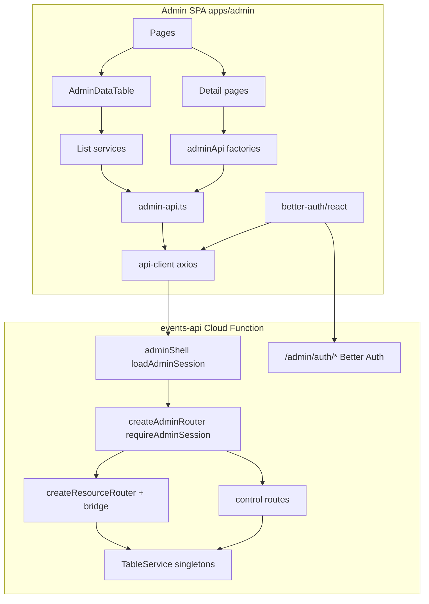

# Admin Panel & Admin API — Architecture Reference

This document describes how the NEON admin portal (`apps/admin`) and its backend API (`functions/events-api` `/admin` surface) are built. It is written so another team or agent can reproduce the same architecture in a different project.

---

## Table of contents

1. [Executive summary](#1-executive-summary)
2. [Monorepo placement](#2-monorepo-placement)
3. [Technology stack](#3-technology-stack)
4. [Shared packages](#4-shared-packages)
5. [Backend: Admin API](#5-backend-admin-api)
6. [Frontend: Admin SPA](#6-frontend-admin-spa)
7. [Authentication](#7-authentication)
8. [Data layer patterns](#8-data-layer-patterns)
9. [HTTP routes catalog](#9-http-routes-catalog)
10. [Environment variables](#10-environment-variables)
11. [Replication guide](#11-replication-guide)
12. [Conventions and anti-patterns](#12-conventions-and-anti-patterns)

---

## 1. Executive summary

The admin system is a **client-only SPA** talking to a **Hono Cloud Function** over HTTP. There is no SSR, no admin-specific API keys in the browser, and no duplicate CRUD logic between frontend and backend.

**Core design principles:**

| Principle | Implementation |
|-----------|----------------|
| Single source of truth per table | `*ResourceMeta` on domain service via `introspectTable()` |
| Generated CRUD where possible | `@neon/resource-api` → `defineResource` + `tableServiceToBridge` |
| Custom ops only when needed | `routes/admin/control/` and `routes/admin/providers/` |
| Strict frontend layering | `admin-api.ts` (HTTP) → list services OR `adminApi` factories (TanStack Query) |
| Cookie session auth | Better Auth + Google OAuth; axios `withCredentials: true` |
| Load-then-assert auth | `loadAdminSession` (never 401) → `requireAdminSession` (401 if missing) |

**High-level data flow:**



---

## 2. Monorepo placement

```
neo-neonclub.ch/
├── apps/
│   └── admin/                    # @neon/admin — Vite SPA (port 5173)
├── functions/
│   └── events-api/               # @neon/events-api — Hono + Drizzle (port 8082)
│       └── src/
│           ├── auth/             # Better Auth, middleware, resolvers
│           ├── routes/
│           │   ├── index.ts      # createAppRouter — mounts admin shell
│           │   └── admin/        # All /admin/* business routes
│           ├── services/         # Domain TableService per table
│           └── db/               # Drizzle schema + auth tables
└── packages/
    ├── resource-api/             # @neon/resource-api — HTTP adapter / CRUD generator
    ├── server-kit/               # @neon/server-kit — logger, CORS, dev server
    └── eslint-config/            # Shared ESLint presets
```

**Workspace wiring:** pnpm workspaces (`apps/*`, `functions/*`, `packages/*`). Admin depends on `@neon/site-locales`; events-api depends on `@neon/resource-api`, `@neon/server-kit`, `better-auth`, `drizzle-orm`, `hono`, `arktype`.

---

## 3. Technology stack

### Admin SPA (`@neon/admin`)

| Layer | Technology | Version (approx.) |
|-------|------------|-------------------|
| Build | Vite | ^6.3 |
| UI framework | React | ^19.2 |
| Routing | React Router | ^7.6 |
| Server state | TanStack Query | ^5.47 |
| Tables | TanStack Table | ^8.21 |
| HTTP | axios | ^1.7 |
| Auth client | better-auth/react | ^1.2 |
| Styling | Tailwind CSS v4 (CSS-first) | ^4.1 |
| Components | Shadcn UI (new-york) on Radix | — |
| Icons | lucide-react | — |
| Toasts | sonner | — |
| PWA | vite-plugin-pwa + Workbox | — |
| Language | TypeScript strict | ^5.7 |

### Admin API (`@neon/events-api` admin surface)

| Layer | Technology | Version (approx.) |
|-------|------------|-------------------|
| HTTP framework | Hono | ^4.7 |
| Validation | ArkType + @hono/arktype-validator | ^2.x |
| ORM | Drizzle ORM | ^0.38 |
| Database | Neon Postgres (@neondatabase/serverless) | — |
| Auth | better-auth + drizzleAdapter | ^1.2 |
| Runtime | Google Cloud Functions Gen 2 | — |
| Local dev | tsx watch + @neon/server-kit serveDevApp | port 8082 |

### Shared packages

| Package | Role |
|---------|------|
| `@neon/resource-api` | TableService, CRUD router generation, list/filter pipeline, ArkType schema builder |
| `@neon/server-kit` | Pino logger, CORS from env, Hono request logging, JSON error handler, dev server |
| `@neon/eslint-config` | Shared TS/React/Node ESLint presets |

---

## 4. Shared packages

### 4.1 `@neon/server-kit`

**Purpose:** Cross-function infrastructure with no business logic.

**Key exports:**

| Export | File | Use in admin API |
|--------|------|------------------|
| `createCorsFromEnv(mode)` | `cors-env.ts` | `"credentials"` mode for cookie-based admin auth |
| `createLogger`, `createHttpRequestLogger` | `logger.ts`, `hono-middleware.ts` | Structured request logging |
| `createHttpJsonErrorHandler` | `hono-middleware.ts` | Consistent JSON error responses |
| `createSecurityHeaders` | `security-headers.ts` | Security headers on all responses |
| `serveDevApp` | `dev-server.ts` | Local Hono dev server |
| `allowedCorsOriginsForSite` | `cors-env.ts` | Origin list for Better Auth trusted origins |

**Dependencies:** `hono`, `@hono/node-server`, `pino`, `resend` (email — not admin-specific).

**CORS credentials mode** reads origins from env: `PUBLIC_SITE_URL`, `EVENTS_ALLOWED_ORIGIN`, `ADMIN_ALLOWED_ORIGIN`, `ALLOWED_ORIGIN` (CSV). Sets `credentials: true` and allows `Cookie`, `Authorization` headers.

**Bootstrap pattern** (`functions/events-api/src/app.ts`):

```typescript
app.use("*", createCorsFromEnv("credentials"));
app.use("*", createSecurityHeaders());
app.use("*", createHttpRequestLogger(log));
app.onError(createHttpJsonErrorHandler(log));
mountBetterAuth(app, auth);
app.route("/", createAppRouter());
```

---

### 4.2 `@neon/resource-api`

**Purpose:** HTTP adapter only. Bridges Drizzle-backed domain services to Hono admin CRUD routes. **No domain logic** — consumers extend `TableService` in their function workspace.

**Peer dependencies (consumer provides):** `hono`, `drizzle-orm`, `arktype`, `@hono/arktype-validator`.

#### Public API surface

**Errors:** `ResourceApiError`, `NotFoundError` (404), `ConflictError` (409), `BadRequestError` (400), `BulkLimitError` (400).

**Table service stack:**
- `AbstractTableService` — CRUD contract
- `TableService` — Drizzle implementation + list pipeline
- `tableServiceToBridge(svc)` — maps service → HTTP-facing `ServiceBridge`
- `toBulkBridge(service, mapCtx)` — bulk mutation wrapper

**Resource router:**
- `defineResource(def)` — register resource definition, return opaque token
- `resolveResource(token)` — retrieve definition
- `createResourceRouter(resource, { mapCtx })` — mount generated CRUD on Hono
- `composeResourceRouter({ resource, control, mapCtx })` — CRUD + nested control Hono

**Introspection & validation:**
- `introspectTable(table, opts?)` → `ResourceMeta` (writable fields, list/read projections, filterable, sortable, search)
- `buildArkTypeSchemas(meta, opts?)` → create/update/listQuery ArkType schemas

**List pipeline:**
- `parseListQuery(raw, maxPageSize?)` — reserved keys: `limit`, `skip`, `sort`, `q`; rest → `filters`
- `resolveAdminListScope(params, idColumn)` — builds WHERE, ORDER BY, LIMIT/OFFSET
- `runAdminListFromScope({ db, table, scope })` — SELECT + COUNT in one call
- `listMetaFromScope(scope, total)` → `{ total, limit, skip }`
- `buildFilterConditions(filters, filterable)` — suffix operators: `_in`, `_not`, `_gt`, `_gte`, `_lt`, `_lte`, `_like`

**Low-level providers (used internally by router):** `listProvider`, `detailProvider`, `bulkProvider`, `actionProvider`.

#### TableService behavior

**Read:**
- `get(id, ctx?)` — full row; respects parent scope via `ServiceContext.parent`
- `getForAdmin(id, ctx?)` — row projected with `meta.project.read`

**List:**
- `list(query, ctx?)` — dispatches on `listExecution()`:
  - `"table"` (default) → standard SQL list
  - `"custom"` → override `executeCustomList` (joins, enrichment)
- `count(query, ctx?)` — parallel custom/table split

**Mutations:**
- `create` / `update` / `delete` — with `beforeCreate`, `beforeUpdate`, `beforeDelete` hooks
- `createBulk` / `updateBulk` — transactional, capped by `maxBulkSize` (default 100)
- Throws `NotFoundError`, `BadRequestError`, `ConflictError` from hooks

**Extension hooks (override in domain service):**

| Hook | When to use |
|------|-------------|
| `parseListQuery(raw)` | Strip custom query params before standard parsing |
| `applyListFilters(query, ctx)` | SQL filters not expressible via filterable suffixes |
| `listExecution(): "custom"` | Enriched list rows (separate list row vs list item types) |
| `executeCustomList` / `executeCustomCount` | Full custom list implementation |
| `beforeDelete(id, ctx?)` | Single-table delete guards (prefer over control DELETE) |

#### Bridge mapping (`tableServiceToBridge`)

```
list              → svc.list
count             → svc.count
get / getDetail   → svc.getForAdmin
create/update     → svc.create/update then projectRead(meta.project.read)
delete            → svc.delete
parseListQuery    → svc.parseListQuery?.bind(svc)
filterMeta        → { filterable: meta.filterable }
```

#### Generated HTTP shapes

| Operation | Method | Response |
|-----------|--------|----------|
| List | `GET /` | `{ items, meta: { total, limit, skip } }` |
| Read | `GET /:id` | `{ item }` or 404 `{ error }` |
| Create | `POST /` | `201 { item }` |
| Update | `PATCH /:id` | `{ item }` |
| Delete | `DELETE /:id` | `204` |
| Bulk create | `POST /bulk` | `201 { items }` |
| Bulk update | `PATCH /bulk` | `200 { items }` |

**Hard requirement:** `createResourceRouter` throws if `def.service` is missing — legacy `crudProvider` fallback was removed.

---

## 5. Backend: Admin API

### 5.1 Request routing chain

```
index.ts
  └── app.ts (CORS, logging, Better Auth mount, createAppRouter)
        └── routes/index.ts (createAppRouter)
              ├── participant/public routes
              └── adminShell (loadAdminSession on *)
                    └── /admin → createAdminRouter()
```

**Critical split:** Better Auth is mounted on the **root app** at `/admin/auth/*`, **outside** `adminShell`. Auth endpoints do not run `requireAdminSession`. All other `/admin/*` routes do.

Files:
- `functions/events-api/src/index.ts`
- `functions/events-api/src/app.ts`
- `functions/events-api/src/routes/index.ts`
- `functions/events-api/src/routes/admin/router.ts`

### 5.2 `routes/admin/` structure

```
routes/admin/
├── router.ts              # createAdminRouter() — mounts all admin routes
├── mount.ts               # adminRoute() — per-mount requireAdminSession shell
├── schemas.ts             # ArkType schemas for control/provider bodies
├── refund.ts              # Shared refund orchestration
├── resources/             # defineResource() — one file per CRUD table
│   ├── events.ts, orders.ts, people.ts, …
├── control/               # Non-CRUD nested actions
│   ├── events.ts          # tiers, images, analytics, admissions, promotion codes
│   ├── orders.ts          # refund
│   ├── people.ts          # create, verify, delete
│   ├── admissions.ts      # cancel check-in
│   ├── api-keys.ts        # global API key management
│   └── maintenance.ts
└── providers/             # Event-scoped multi-step ops
    ├── invitees.ts        # upsert, export, revoke, link management
    ├── invitees-admin.ts  # orchestration helpers (no HTTP)
    ├── invitees-export.ts
    └── people-admin.ts
```

### 5.3 `adminRoute()` mount helper

Each admin subtree gets its own Hono shell with assert middleware:

```typescript
export function adminRoute(admin, path, subApp, ...middleware) {
  const shell = new Hono();
  shell.use("*", ...middleware);  // typically requireAdminSession
  shell.route("/", subApp);
  admin.route(path, shell);
}
```

Combined with outer `loadAdminSession`, the pattern is: **load on shell → assert on mount → handler reads `c.var.adminSession`**.

### 5.4 Resource + control wiring

**Simple resource (list/read/delete only):**

```typescript
// routes/admin/resources/orders.ts
export const orders = defineResource({
  table: ordersTable,
  meta: ordersResourceMeta,
  service: tableServiceToBridge(ordersService),
  opts: { operations: ["list", "read", "delete"] },
});
```

**Resource + control router:**

```typescript
// routes/admin/router.ts
mountResource(admin, "/orders", orders, createOrdersControlRouter());
// internally: composeResourceRouter({ resource, control, mapCtx })
```

**Domain service (single source of truth):**

```typescript
// services/orders.service.ts
export const ordersResourceMeta = introspectTable(orders, {
  fields: { list: [...], read: [...] },
  list: { defaultSort: "-createdAt" },
});

export class OrdersService extends TableService<...> {
  constructor() {
    super({ table: orders, meta: ordersResourceMeta, defaultSort: "-createdAt" });
  }
  protected override async beforeDelete(id, ctx?) {
    // throw ConflictError if not deletable
  }
}
export const ordersService = new OrdersService();
```

**Local TableService wrapper** injects DB:

```typescript
// services/base/table-service.ts
export class TableService<...> extends BaseTableService<...> {
  constructor(config) {
    super({ ...config, getDb: () => getDb() });
  }
}
```

**ServiceContext propagation:**

```typescript
// services/base/map-ctx.ts
export function mapCtx(c, parent?) {
  return {
    hono: c,
    parent,
    adminSession: c.var.adminSession,
  };
}
```

### 5.5 When to use what

| Pattern | Use for | Example |
|---------|---------|---------|
| Generated CRUD (`defineResource`) | Single-table list/read/create/update/delete | `/admin/orders`, `/admin/events` |
| Service `beforeDelete` | Delete guards on one row | Promotion code with orders |
| Control route | Multi-step, external IO, non-REST shape | `POST /admin/orders/:id/refund` |
| Provider | Event-nested paths, CSV export, upsert | `/admin/events/:eventId/invitees` |

**Forbidden:**
- Business logic reachable only via admin HTTP
- Routes importing Drizzle/schema directly (use services)
- Duplicate `introspectTable` in resources or providers
- Standalone list providers for tables that have `TableService`

### 5.6 Validation

**Two schema locations:**

1. **Generated CRUD** — `buildArkTypeSchemas(meta, opts.schemas)` from column introspection; validated via `@hono/arktype-validator` in `createResourceRouter`.
2. **Control/providers** — hand-written ArkType `type()` in `routes/admin/schemas.ts` or `schemas.ts`; validated with `.assert(await c.req.json())` or `actionProvider` schema option.

Per-resource schema overrides example (events create/update allow nullable summary):

```typescript
opts: {
  schemas: { create: { summary: "unknown | null" }, update: { summary: "unknown | null" } },
}
```

### 5.7 Error handling

`createAdminRouter()` registers `onError`:
- `ResourceApiError` → `{ error: message }` + `statusCode`
- Domain errors (e.g. `InviteMechanismDisabledError`) → 403

Unmapped errors bubble to app-level `createHttpJsonErrorHandler`.

### 5.8 ESLint boundary

`functions/events-api/.eslintrc.json` forbids:
- `routes/` and `helpers/` importing Drizzle or `db/schema`
- Non-admin routes importing `@neon/resource-api` router modules or `routes/admin/**`

Multi-table writes = route `runTransaction` + service `*InTx` methods.

---

## 6. Frontend: Admin SPA

### 6.1 Entry and routing

**Entry:** `src/main.tsx` → `App.tsx`

**Router** (`App.tsx`, React Router v7):

```
/login                                    LoginPage (public)

/  (AuthGuard → AdminLayout)
├── /                                     → redirect /events
├── /events                               EventsPage
├── /events/new                           EventFormPage
├── /events/:eventId                      EventWorkspaceOutlet (UUID guard)
│   ├── overview, settings, tiers, promotions, api-keys
│   ├── invitees, orders, admissions
│   ├── orders/:orderId                   OrderDetailPage
│   └── admissions/:admissionId           AdmissionDetailPage
├── /people                               PeoplePage
├── /people/:id                           PersonDetailPage
├── /api-keys                             ApiKeysPage (global)
└── /maintenance                          MaintenancePage
```

**Basename:** `VITE_ADMIN_BASE` / `import.meta.env.BASE_URL` (e.g. `/admin/` on GitHub Pages).

**Layout nesting:**
- `AuthGuard` — session check, redirect to `/login`
- `AdminLayout` — sidebar + header + `<Outlet />`
- `EventWorkspaceOutlet` — validates UUID `:eventId`; switches sidebar to event-scoped nav

### 6.2 Folder structure

```
src/
├── pages/                      # Route-level components (17 pages)
├── components/
│   ├── ui/                     # Shadcn primitives ONLY place for Radix
│   ├── layout/                 # AdminLayout, sidebar, header, event workspace
│   ├── admin-data-table/       # AdminDataTable + column helpers
│   └── admin-fk/               # AdminFkCell
├── hooks/
│   ├── use-admin-api/          # keys.ts, api.ts — TanStack Query factories
│   └── use-foreign-key.ts      # Batched FK resolution
└── lib/
    ├── admin-api.ts            # All HTTP functions + row types
    ├── api-client.ts           # axios instance
    ├── admin-list-services/    # Paginated list registry
    ├── admin-fk-services/      # event/person/order FK loaders
    ├── auth-client.ts          # Better Auth client
    └── admin-base.ts           # basename helpers
```

### 6.3 Three-layer API client

**Layer 1 — Transport (`lib/api-client.ts`):**

```typescript
export const api = axios.create({
  baseURL: import.meta.env.DEV ? "" : import.meta.env.VITE_EVENTS_API_URL,
  withCredentials: true,
});
```

Types: `ListResponse<T>`, `ItemResponse<T>`, `ListMeta` (`total`, `limit`, `skip`).

**Layer 2 — Imperative HTTP (`lib/admin-api.ts`):**

- Row types mirror backend `*ResourceMeta.project.list/read` (commented in source)
- List endpoints via `createAdminListClient<TRow>("/admin/{resource}")`
- Detail/mutation functions: `getEvent`, `refundOrder`, `upsertInvitees`, etc.
- Query params: `limit`, `skip`, `sort`, `q`, plus filter suffixes (`eventId`, `id_in`, `orderStatus`, …)

**Layer 3 — TanStack Query factories (`hooks/use-admin-api/`):**

- `keys.ts` — hierarchical keys under `["admin", resource, …]`
- `api.ts` — `adminApi` object with `queryOptions` / `mutationOptions`

**Strict rule:** Paginated list pages use `*ListService.listQuery()` — **not** `adminApi.*.list`. Detail pages and mutations use `adminApi`.

### 6.4 List services

**Registry** (`lib/admin-list-services/registry.ts`) — one entry per paginated table:

| Service | Scope | Notes |
|---------|-------|-------|
| `eventsListService` | — | |
| `ordersListService` | `{ eventId }` | |
| `peopleListService` | `{ q? }` | search |
| `eventInviteesListService` | `{ eventId }` | `{ orderStatus? }` filter |
| `admissionsListService` | `{ eventId }` | |
| `eventPromotionCodesListService` | `{ eventId }` | |

**Factory** (`create.ts`):
- Converts UI `page`/`pageSize` → API `limit`/`skip`
- Builds TanStack `queryOptions` with stable query keys
- Optional `buildQueryParams`, `enabled(scope)`, `queryKeyExtra`

**HTTP client** (`create-admin-list-client.ts`):

```typescript
createAdminListClient<TRow>(path) → GET path with params → ListResponse<TRow>
```

**Usage:**

```tsx
<AdminDataTable columns={columns} service={eventsListService} />
<AdminDataTable scope={{ eventId }} fkScope={{ eventId }} service={ordersListService} />
```

### 6.5 AdminDataTable pipeline

`components/admin-data-table/admin-data-table.tsx`:

1. `useAdminListState` — local page, pageSize, sort
2. `service.listQuery({ page, pageSize, sort, scope, filters })` — server fetch
3. `extractFkServicesFromColumns` → `useForeignKey` — batched FK resolution
4. TanStack Table with `manualPagination` + `manualSorting`
5. `DataTable` + `AdminListPagination`

Context exposes: items, meta, loading, filters, FK lookups, refetch.

### 6.6 Foreign key batching (`useForeignKey`)

**Problem:** List rows show related entity titles (event name, person name) without N+1 detail requests.

**Solution:**
- Column defs declare FK via `adminFkColumn({ fkService, foreignId, … })`
- `useForeignKey({ rows, load: [eventFkService, personFkService], scope? })`
- Dedupes IDs, one batched `GET /admin/{resource}?id_in=…` per FK service per page
- Renders via `AdminFkCell`

**FK services** (`lib/admin-fk-services/`): `eventFkService`, `personFkService`, `orderFkService` — each wraps a list function from `admin-api.ts`.

### 6.7 UI stack rules

- **Shadcn only** — components from `@/components/ui/*`
- **Radix** confined to `components/ui/**` (ESLint enforced)
- **No raw HTML** form controls outside Shadcn wrappers (ESLint enforced)
- **No HeroUI/MUI** in admin (web app uses HeroUI separately)
- Tailwind v4 CSS-first; design tokens in `index.css` `@theme`
- Dark mode permanent: `<html class="dark">`

Add primitives: `pnpm dlx shadcn@latest add <component>` from `apps/admin/`.

### 6.8 Dev proxy and deployment

**Vite dev proxy** (`vite.config.ts`):

```typescript
proxy: {
  "/api": { target: "http://localhost:8082", changeOrigin: true },
  "/admin": { target: "http://localhost:8082", changeOrigin: true },
}
```

All admin API and auth calls go through the proxy in dev. Production uses `VITE_EVENTS_API_URL` directly.

**PWA:** Workbox navigate fallback excludes `/admin/auth` so OAuth callbacks are not swallowed.

---

## 7. Authentication

### 7.1 Overview

| Concern | Implementation |
|---------|----------------|
| Provider | Google OAuth only (Better Auth) |
| Session storage | Postgres via Drizzle adapter (`auth_user`, `auth_session`, …) |
| Domain restriction | `@neonclub.ch` emails only (DB hook + session resolver) |
| Transport | HTTP-only session cookies |
| Client | `better-auth/react` with `withCredentials: true` |
| Dev bypass | `ADMIN_AUTH_DISABLED=1` (API) + `VITE_ADMIN_AUTH_DISABLED=1` (SPA) |

Admin auth is **separate** from participant session cookies (`neon_ev_participant`).

### 7.2 Backend auth setup

**Better Auth config** (`functions/events-api/src/auth/auth.ts`):

- `baseURL`: `{EVENTS_API_PUBLIC_URL}/admin/auth`
- `secret`: `BETTER_AUTH_SECRET`
- `database`: Drizzle adapter on auth tables
- `socialProviders.google`: `GOOGLE_CLIENT_ID`, `GOOGLE_CLIENT_SECRET`
- `databaseHooks.user.create.before`: reject non-`@neonclub.ch`
- `trustedOrigins`: CORS origins + `ADMIN_ALLOWED_ORIGIN` + localhost:5173
- `advanced.crossSubDomainCookies`: optional for prod subdomains

**Mount** (`auth/mount.ts`):

```typescript
app.on(["POST", "GET"], "/admin/auth/*", (c) =>
  auth.handler(toPublicAuthRequest(c.req.raw, c.req.path, publicUrl)),
);
```

URL rewrite ensures Better Auth sees the public CDN path.

**Auth tables** (`db/auth-schema.ts`): separate from business `people` table.

### 7.3 Load + assert middleware

**Loader** (`auth/middleware/loaders.ts` — `loadAdminSession`):
- Resolve session via `getAuth().api.getSession({ headers })`
- Or dev bypass → synthetic session
- `c.set("adminSession", session)` if valid
- **Always `next()`** — never returns 401

**Assert** (`auth/middleware/assert.ts` — `requireAdminSession`):
- Read `c.var.adminSession` only (never re-resolve)
- 401 if missing or email not `@neonclub.ch`
- Skipped when dev bypass active

**Route wiring:**

```typescript
// routes/index.ts
adminShell.use("*", loadAdminSession);
adminShell.route("/admin", createAdminRouter());

// routes/admin/router.ts — every mount
adminRoute(admin, path, router, requireAdminSession);
```

### 7.4 Frontend auth flow

**Client** (`lib/auth-client.ts`):

```typescript
const AUTH_PATH = "/admin/auth";
createAuthClient(
  import.meta.env.DEV
    ? { baseURL: "", basePath: AUTH_PATH }
    : { baseURL: `${VITE_EVENTS_API_URL}${AUTH_PATH}` },
);
export const { useSession, signIn, signOut } = authClient;
```

**Login** (`pages/login-page.tsx`):

```typescript
signIn.social({ provider: "google", callbackURL: adminAbsoluteUrl("events") });
```

**Guard** (`components/auth-guard.tsx`):
- `useSession()` → spinner while pending
- No session → `<Navigate to="/login" />`
- Dev bypass skips check

**Sign out:** `signOut()` in sidebar footer.

OAuth callback URL on API: `{EVENTS_API_PUBLIC_URL}/admin/auth/callback/google`.

---

## 8. Data layer patterns

### 8.1 End-to-end: adding a new CRUD table

**Backend:**

1. Add Drizzle table in `db/schema.ts`; run migration.
2. Create `services/foo.service.ts`:
   - `export const fooResourceMeta = introspectTable(foo, { fields, list, exclude })`
   - `class FooService extends TableService { … }`
   - `export const fooService = new FooService()`
   - Optional: `beforeDelete`, `parseListQuery`, `applyListFilters`, custom list
3. Create `routes/admin/resources/foo.ts`:
   - `defineResource({ table, meta, service: tableServiceToBridge(fooService), opts })`
4. Mount in `routes/admin/router.ts`:
   - `mountResource(admin, "/foos", foo)` or with control router
5. If custom actions needed: `routes/admin/control/foo.ts` + `composeResourceRouter`

**Frontend:**

1. Add row type to `admin-api.ts` with meta comment.
2. Add `createAdminListClient<FooRow>("/admin/foos")` export.
3. If paginated list page: add `foosListService` to `admin-list-services/registry.ts`.
4. Add `adminKeys.foos` in `hooks/use-admin-api/keys.ts`.
5. Add detail/mutation factories in `hooks/use-admin-api/api.ts` if needed.
6. Create page with `AdminDataTable` + column defs; use `adminFkColumn` for FKs.

### 8.2 List query contract

**Request (HTTP query params):**

| Param | Meaning |
|-------|---------|
| `limit` | Page size (default 100, max 100) |
| `skip` | Offset |
| `sort` | `field` or `-field` for DESC |
| `q` | Full-text search across `searchFields` |
| `{field}` | Exact filter |
| `{field}_in` | Comma-separated IN |
| `{field}_gte`, `_lte`, … | Range filters per column kind |

**Response:**

```json
{
  "items": [ /* projected list rows */ ],
  "meta": { "total": 42, "limit": 10, "skip": 0 }
}
```

**Frontend pagination:** UI uses `page`/`pageSize`; converted to `limit`/`skip` only at HTTP boundary (`pageToLimitSkip`).

### 8.3 Detail and related data

Detail pages use `adminApi.{resource}.detail(id)`.

Related 0–1 row fetches use `relatedListParams` + `relatedListFirst` from `lib/admin-related-list.ts` (not separate detail endpoints per relation).

### 8.4 Mutations and cache invalidation

Mutations in `api.ts` call `invalidateQueries` on success:

```typescript
await queryClient.invalidateQueries({ queryKey: adminKeys.orders.all });
```

Invalidate the broadest prefix that covers affected list/detail views.

### 8.5 Custom admin list example (event invitees)

Backend `EventInviteesService`:
- `parseListQuery` — strips `orderStatus`, injects into filters
- `applyListFilters` — subquery for order status when scoped to event
- `resolveAdminListScopeFromRaw` — shared by list + CSV export

Frontend `eventInviteesListService`:
- Scope: `{ eventId }`
- Filters: `{ orderStatus? }`
- Same params for export endpoint

---

## 9. HTTP routes catalog

All routes require admin session except `/admin/auth/*`.

### 9.1 Better Auth (unauthenticated shell)

`GET|POST /admin/auth/*` — session, OAuth, sign-out (Better Auth library routes).

### 9.2 Generated CRUD resources

| Resource | Path | Operations |
|----------|------|------------|
| events | `/admin/events` | list, read, create, update |
| people | `/admin/people` | list, read, update |
| orders | `/admin/orders` | list, read, delete |
| event-invitees | `/admin/event-invitees` | list, read, update, delete |
| event-tiers | `/admin/event-tiers` | list, read |
| order-tiers | `/admin/order-tiers` | list |
| admissions | `/admin/admissions` | list, read |
| invite-redemptions | `/admin/invite-redemptions` | list |
| invite-links | `/admin/invite-links` | list, read |
| promotion-codes | `/admin/promotion-codes` | list, read, delete |
| event-registrations | `/admin/event-registrations` | list, read |

Standard shapes per resource: `GET /`, `GET /:id`, `POST /`, `PATCH /:id`, `DELETE /:id` (where enabled).

### 9.3 Control routes

**Orders:**
- `POST /admin/orders/:id/refund` → `202 { pending: true }`

**People:**
- `POST /admin/people/create`
- `POST /admin/people/verify`
- `GET /admin/people/:id/deletion-eligibility`
- `DELETE /admin/people/:id`

**Events:**
- `PUT /admin/events/:id/tiers`
- `GET|POST /admin/events/:id/promotion-codes`
- `PATCH /admin/events/:id/promotion-codes/:promotionCodeId`
- `GET|POST /admin/events/:id/api-keys`
- `GET /admin/events/:id/sales-analytics`
- `GET /admin/events/:id/admissions/summary`
- `POST /admin/events/:id/admissions/provision-signing-key`
- `POST /admin/events/:id/admissions/generate`
- `POST /admin/events/:id/admissions/regenerate-all`
- `GET|POST|PATCH|PUT|DELETE /admin/events/:id/images/…`

**Admissions:**
- `POST /admin/admissions/:id/cancel-check-in`

**Maintenance:**
- `GET|POST /admin/maintenance`

**API keys (global):**
- `GET /admin/api-keys`
- `POST /admin/api-keys`
- `POST /admin/api-keys/:id/revoke`
- `POST /admin/api-keys/:id/rotate`
- `DELETE /admin/api-keys/:id`

### 9.4 Event-scoped providers

**Invitees** (`/admin/events/:eventId/…`):
- `GET /invitees/export`
- `POST /invitees`
- `POST /invitees/:inviteeId/revoke`
- `DELETE /invitees/:inviteeId`
- `POST /invitees/:inviteeId/ensure-link`
- `POST /invitees/:inviteeId/regenerate-link`

**Invite links:**
- `PATCH /invite-links/:linkId`
- `DELETE /invite-links/:linkId`
- `GET /invite-links/:linkId/token`
- `POST /invite-links/:linkId/rotate-token`

---

## 10. Environment variables

### Admin SPA (`apps/admin/.env.example`)

| Variable | Purpose |
|----------|---------|
| `VITE_EVENTS_API_URL` | Production API root (axios + auth client) |
| `VITE_PUBLIC_SITE_URL` | Public site for invite/login links |
| `VITE_PUBLIC_SITE_DEFAULT_LOCALE` | Locale in copied URLs |
| `VITE_ADMIN_BASE` | Router/vite base (`/admin/` on static hosting) |
| `VITE_ADMIN_AUTH_DISABLED` | Dev-only UI auth bypass |
| `VITE_ADMIN_AUTH_DEV_EMAIL` | Display email when bypassed |
| `VITE_ADMIN_BUILD_LABEL` | Compile-time build stamp |

### Events API admin-related (`functions/events-api/.env.example`)

| Variable | Purpose |
|----------|---------|
| `DATABASE_URL` | Postgres (Better Auth + business data) |
| `EVENTS_API_PUBLIC_URL` | Public API root; Better Auth base URL |
| `BETTER_AUTH_SECRET` | Session signing |
| `GOOGLE_CLIENT_ID` / `GOOGLE_CLIENT_SECRET` | Google OAuth |
| `ADMIN_ALLOWED_ORIGIN` | CORS + Better Auth trusted origins (admin SPA URL) |
| `BETTER_AUTH_CROSS_SUBDOMAIN` | `1` for cross-subdomain cookies |
| `BETTER_AUTH_COOKIE_DOMAIN` | e.g. `.example.com` |
| `ADMIN_AUTH_DISABLED` | Dev-only API auth bypass |
| `ADMIN_AUTH_DEV_EMAIL` | Synthetic session email when bypassed |
| `PUBLIC_SITE_URL`, `EVENTS_ALLOWED_ORIGIN`, `ALLOWED_ORIGIN` | Additional CORS origins |

---

## 11. Replication guide

Use this checklist to build the same admin stack in a greenfield project.

### Phase 1 — Monorepo foundation

1. **pnpm workspace** with `apps/*`, `functions/*`, `packages/*`.
2. **Shared TS config** — strict mode, `moduleResolution: "bundler"`, Node 22.
3. Create **`@neon/server-kit`** (or equivalent):
   - Pino logger
   - `createCorsFromEnv("credentials")`
   - Hono request logging + JSON error handler
   - `serveDevApp` for local dev
4. Create **`@neon/resource-api`** (or equivalent):
   - Port `TableService`, `introspectTable`, `tableServiceToBridge`, `defineResource`, `createResourceRouter`, list pipeline, errors
   - Peer deps: hono, drizzle-orm, arktype, @hono/arktype-validator
   - No runtime deps — pure adapter layer

### Phase 2 — Backend function

1. **Hono app bootstrap** with server-kit middleware.
2. **Drizzle + Postgres** — business schema + separate Better Auth schema.
3. **Better Auth**:
   - Google OAuth
   - Domain/email restriction hook
   - Mount at `/admin/auth/*` on root app (before admin shell)
   - `crossSubDomainCookies` if SPA and API on different subdomains
4. **Auth middleware factory** (`createFactory<AppEnv>()`):
   - `loadAdminSession` (loader)
   - `requireAdminSession` (assert)
   - `resolveAdminSession` via `getAuth().api.getSession`
5. **Domain services** — one `*.service.ts` per table:
   - `*ResourceMeta = introspectTable(...)`
   - `class XxxService extends TableService` with `getDb` injected
   - Singleton export
6. **Admin router**:
   - `adminShell.use("*", loadAdminSession)`
   - `createAdminRouter()` with `adminRoute(..., requireAdminSession)`
   - `defineResource` + `tableServiceToBridge` for each CRUD table
   - `composeResourceRouter` where control routes exist
7. **Control/providers** for multi-step ops only.
8. **ESLint boundary** — routes cannot import Drizzle directly.

### Phase 3 — Admin SPA

1. **Vite + React + TypeScript** app in `apps/admin`.
2. **Tailwind v4 + Shadcn** — init with `components.json`; enforce Radix confinement via ESLint.
3. **React Router** — `AuthGuard` → `AdminLayout` → pages; basename for subpath deploy.
4. **Better Auth client** — `createAuthClient` with dev proxy path `/admin/auth`.
5. **axios client** — `withCredentials: true`; dev baseURL `""`, prod `VITE_API_URL`.
6. **Vite proxy** — `/admin` and `/api` → function dev port.
7. **Three-layer API**:
   - `admin-api.ts` — all HTTP + row types
   - `admin-list-services/` — paginated lists only
   - `hooks/use-admin-api/` — TanStack Query factories for detail/mutations
8. **AdminDataTable** — server pagination, manual sort, FK batching.
9. **useForeignKey** + FK service registry — no N+1 on list pages.
10. **Login page** — Google OAuth; guard all routes except `/login`.

### Phase 4 — CDN / deployment

1. **API:** Cloud Run / GCF with CORS credentials mode; `ADMIN_ALLOWED_ORIGIN` = admin SPA origin.
2. **SPA:** Static hosting (GitHub Pages, GCS, etc.) with SPA fallback; PWA optional.
3. **CDN routing:** Ensure `/admin/auth/*` hits the API, not the SPA fallback.
4. **Cookies:** Configure `BETTER_AUTH_COOKIE_DOMAIN` + `crossSubDomainCookies` when API and SPA differ by subdomain.
5. **No API keys in browser** — session cookies only.

### Phase 5 — Adding each new resource (ongoing)

See [§8.1 End-to-end: adding a new CRUD table](#81-end-to-end-adding-a-new-crud-table).

**Minimum files per resource:**

| Layer | Files |
|-------|-------|
| DB | `schema.ts` + migration |
| Service | `services/foo.service.ts` |
| Resource | `routes/admin/resources/foo.ts` |
| Router | one line in `router.ts` |
| SPA types | row type in `admin-api.ts` |
| SPA list | registry entry + page + columns |
| SPA detail | `adminApi.foo.detail` + page (if needed) |

---

## 12. Conventions and anti-patterns

### MUST

- One `introspectTable` per table, on the service file, exported as `*ResourceMeta`
- `TableService` constructor uses that same meta
- Admin resources pass `meta` + `service: tableServiceToBridge(svc)` — never duplicate field lists in resources
- Paginated lists: `*ListService` + `AdminDataTable`
- Detail/mutations: `adminApi` factories — not inline `useQuery({ queryFn })`
- FK display: `useForeignKey` + `adminFkColumn` / `AdminFkCell`
- Delete guards on one table: `beforeDelete` on service + generated CRUD delete — not custom control DELETE
- Custom list logic: overrides on `TableService` — not separate list provider files
- Load auth on shell, assert on protected routes
- Row types in SPA mirror backend list/read projections (keep in sync via comments)

### FORBIDDEN

- `@radix-ui/*` imports outside `components/ui/**` (admin)
- Raw `<button>`, `<input>`, etc. outside Shadcn (admin)
- `adminApi.{resource}.list` for pages that have a list service
- N+1 `GET /:id` per table row for FK display
- `crudProvider` / duplicate introspect in resources
- Routes importing Drizzle/schema
- Business logic only reachable via admin HTTP
- Browser `ADMIN_API_KEY` or similar — use Better Auth cookies
- Per-table list-service files — extend central registry (~10 lines each)

### Control flow style

Prefer guard clauses / early returns in routes, services, and non-trivial client logic. API handlers return on first failed guard.

---

## Quick reference: key files

| Concern | Path |
|---------|------|
| Admin SPA entry | `apps/admin/src/main.tsx`, `App.tsx` |
| Admin HTTP client | `apps/admin/src/lib/admin-api.ts` |
| TanStack factories | `apps/admin/src/hooks/use-admin-api/api.ts` |
| List services | `apps/admin/src/lib/admin-list-services/registry.ts` |
| AdminDataTable | `apps/admin/src/components/admin-data-table/` |
| Auth client | `apps/admin/src/lib/auth-client.ts` |
| Vite config + proxy | `apps/admin/vite.config.ts` |
| API bootstrap | `functions/events-api/src/app.ts` |
| Route mounting | `functions/events-api/src/routes/index.ts` |
| Admin router | `functions/events-api/src/routes/admin/router.ts` |
| Better Auth | `functions/events-api/src/auth/auth.ts` |
| Auth middleware | `functions/events-api/src/auth/middleware/` |
| TableService base | `functions/events-api/src/services/base/table-service.ts` |
| Example service | `functions/events-api/src/services/orders.service.ts` |
| Example resource | `functions/events-api/src/routes/admin/resources/orders.ts` |
| resource-api package | `packages/resource-api/src/` |
| server-kit package | `packages/server-kit/src/` |

---

*Generated from the NEON monorepo (`neo-neonclub.ch`). For domain-specific rules (events, invitees, checkout), see `AGENTS.md` at the repo root.*
